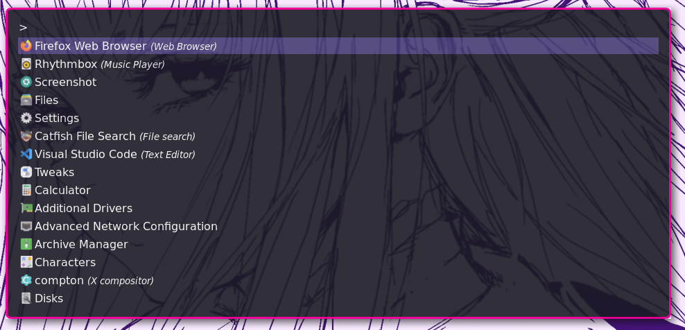
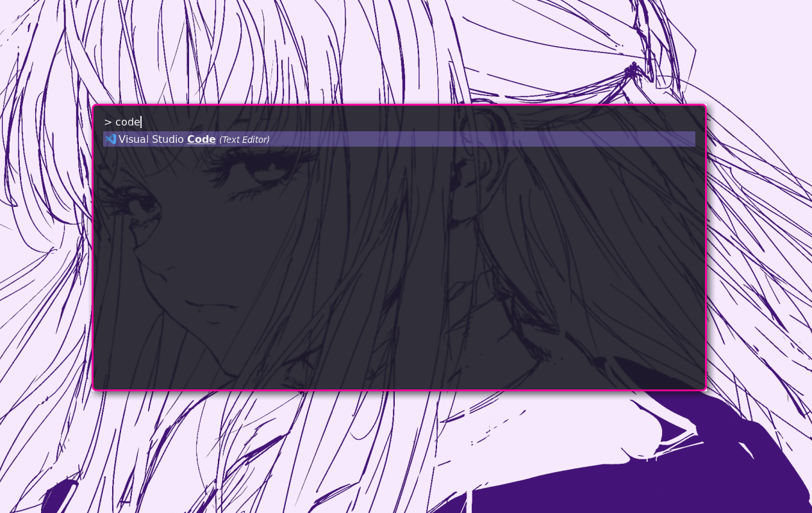

# Blossom Theme for Rofi

## Preview


### ! Transparency in the screenshots are from the compositor(Compton) not from the Rofi Theme !

## Installation
1. Clone the repository.
```git clone https://github.com/BlossomTheme/Rofi.git```

2. Copy the ```blossom.rasi``` file to ```~/.config/rofi``` as ```config.rasi```.
```cp ./blossom.rasi ~/.config/rofi/config.rasi```

3. Run Rofi and select the theme if needed.

